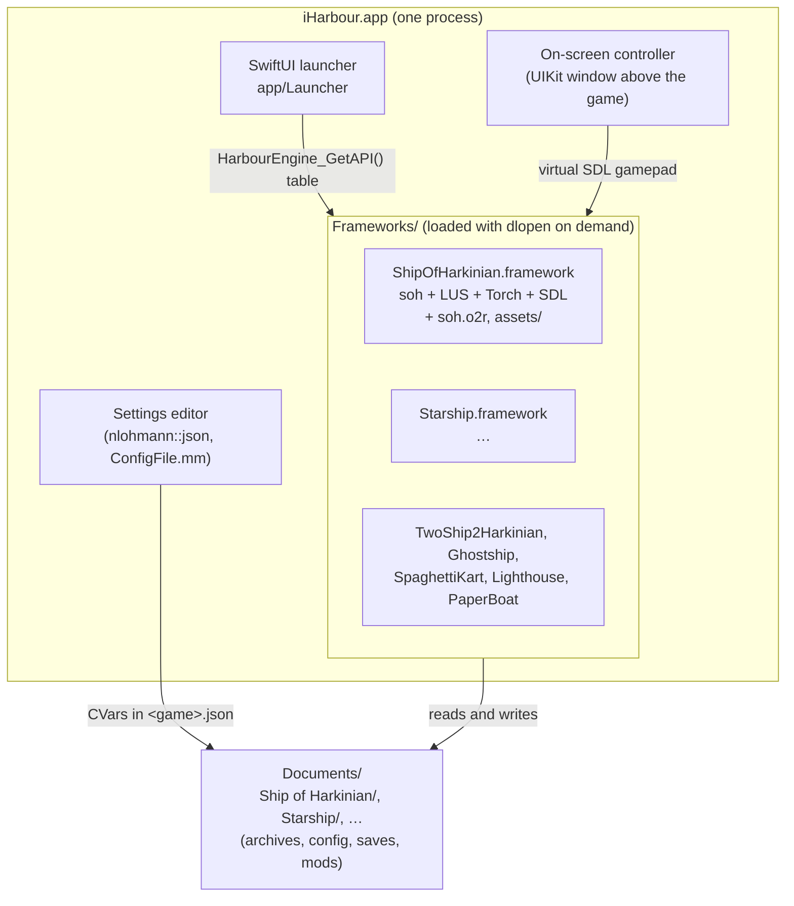
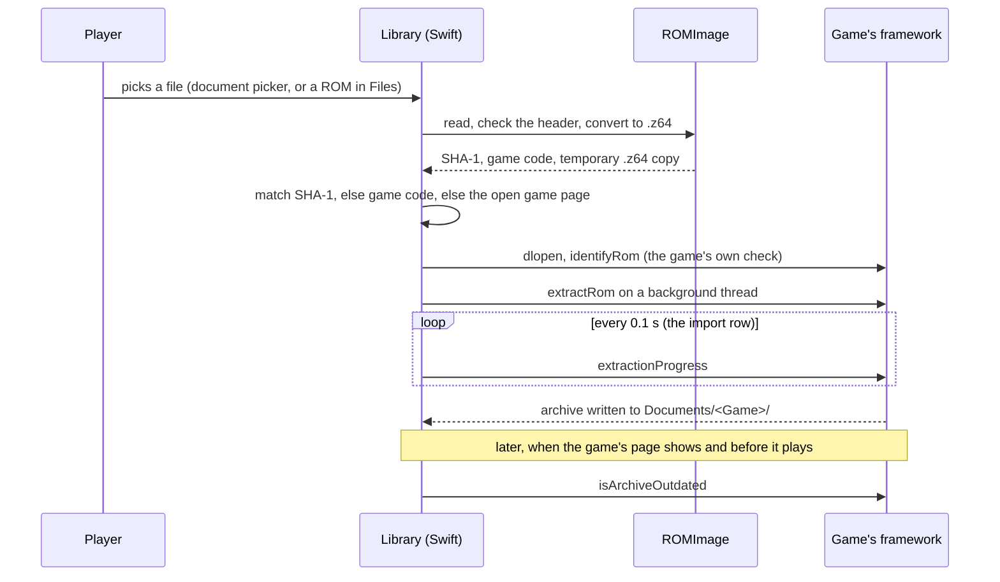
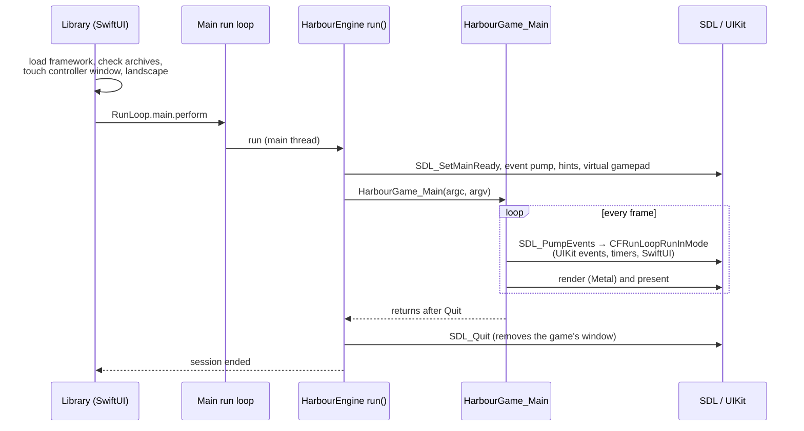
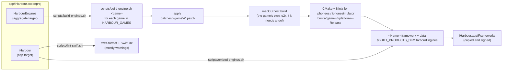

# How iHarbour works

iHarbour is one iOS app that runs several libultraship games: PC ports of classic console games by
the Harbour Masters and friends. Each game is its own C/C++ codebase with its own copy of
libultraship, SDL, ImGui and asset extractor. iHarbour keeps them apart by building each game as a
framework of its own and loading only the frameworks it needs, when it needs them.

- [The pieces](#the-pieces)
- [One framework per game](#one-framework-per-game)
- [Loading a game](#loading-a-game)
- [Files: what lives where](#files-what-lives-where)
- [Adding a ROM](#adding-a-rom)
- [Playing](#playing)
- [Settings](#settings)
- [The build](#the-build)
- [Decisions and their reasons](#decisions-and-their-reasons)

## The pieces



| Directory | Contents |
| --- | --- |
| `games/` | The games, as unmodified upstream submodules. |
| `patches/` | What each game (and its libultraship, Torch, ...) needs changed for iOS, plus the SDL patch every game shares. Applied at build time. |
| `ports/<game>/` | Per game: the build recipe (`port.sh`), the glue between the shared engine code and the game (`*Port.mm`), and optional extra CMake (`port.cmake`). |
| `engine/` | Code compiled into every game's framework: the C interface the app sees (`HarbourEngine.h`), running SDL inside the app, the virtual gamepad, the framework's `Info.plist.in`. |
| `cmake/` | `HarbourIOS.cmake` (iOS dependencies and the framework helper, included by each game's patched CMakeLists), `git-patch.cmake` (applies a patch to a FetchContent checkout), `ios-toolchain-stub/`. |
| `scripts/` | The build: `build-engine.sh <game>`, the three Xcode build phases (`lint-swift.sh`, `build-engines.sh`, `embed-engines.sh`), `unapply-patches.sh`, and `lib/common.sh`, the helpers the build and patch scripts share. |
| `app/` | The Xcode project, its xcconfigs and Info.plist, the SwiftUI launcher (`Launcher/`), and nlohmann::json (`ThirdParty/`). |
| repository root | `Makefile` (lint, format, git hooks), `Mintfile` (pinned SwiftLint), `.swift-format`, `.swiftlint.yml`, `.githooks/`. |

## One framework per game

Every game builds with its own CMake project, the same one its desktop builds use, with
`CMAKE_SYSTEM_NAME=iOS` and Ninja. On iOS, the patched CMakeLists builds the game as a shared
library instead of an executable, and `harbour_add_game_framework()` turns it into
`<Name>.framework`:

- it adds `engine/*` (`.h`, `.cpp`, `.mm`) and `ports/<game>/*` (`.h`, `.c`, `.cpp`, `.mm`) to the
  game's target, and defines `HARBOUR_IOS=1`, `HARBOUR_GAME_ID` and `HARBOUR_FRAMEWORK_NAME`;
- it links SDL2, SDL2_net, the audio codecs and the system frameworks;
- it links with `-exported_symbol _HarbourEngine_GetAPI` and `-dead_strip`: **the framework exports
  exactly one symbol**;
- it gives the framework the bundle identifier `org.iharbour.engine.<game>` and an Info.plist made
  from `engine/Info.plist.in`.

The single exported symbol is what makes several games in one process safe. Each framework
contains its own libultraship, SDL, ImGui, spdlog, nlohmann::json, all at different versions. If
their symbols were exported, dyld would coalesce C++ weak definitions (inline functions, template
statics, typeinfo) across frameworks, and game A would end up calling game B's copy of an ImGui or
spdlog function built from a different version. With nothing exported but the entry point, each
framework is a closed world.

Objective-C classes are the exception: the runtime's class table is process-wide, so two loaded
frameworks both register `SDL_uikitview` and friends, and the runtime logs a duplicate-class
warning. Each framework's code refers to its own classes directly (resolved at link time), so this
doesn't mix them up; only lookups by name would be ambiguous, and SDL doesn't do those when the app
owns `main`. The launcher still loads as few frameworks as it can (see below).

### The engine interface

`engine/HarbourEngine.h` is plain C, shared by the frameworks and the app. `HarbourEngine_GetAPI()`
returns a table:

| Member | Purpose |
| --- | --- |
| `version` | `HARBOUR_ENGINE_API_VERSION` the framework was built with. |
| `gameId`, `gameVersion` | The game's id (its folder in `ports/`) and version. |
| `setDataDirectory` | The game's folder in Documents. |
| `run`, `isRunning`, `hasRun` | Runs the game on the main thread until it quits. |
| `setTouchControllerConnected`, `setButton`, `setAxis` | The on-screen controller, as an SDL virtual gamepad. |
| `toggleMenu`, `isMenuOpen` | The game's ImGui menu. |
| `identifyRom`, `extractRom`, `extractionProgress` | The game's own ROM check and asset extraction, in-process. `identifyRom` also fills a description of anything the catalog can't tell ("language pack"). |
| `isArchiveOutdated` | The game's archive version check. |

`engine/HarbourEngine.mm` implements the parts that are the same for every game (SDL setup,
gamepad, data directory). The rest goes through `engine/HarbourPort.h`, which each game implements
in `ports/<game>/`. The engine catches C++ exceptions from `isMenuOpen`, `identifyRom`,
`extractRom` and `isArchiveOutdated` so none reaches Swift; an archive whose check throws counts as
outdated.

The app refuses a framework whose `version` differs from its own `HARBOUR_ENGINE_API_VERSION`
(currently 1).

## Loading a game

The app links none of the games. `GameEngine.load(_:)` (`app/Launcher/Engine/GameEngine.swift`):

1. creates the game's folder in Documents and sets `SHIP_HOME` to it: some games compute paths in
   static initializers, which run inside `dlopen`;
2. `dlopen`s `Frameworks/<Name>.framework/<Name>` with `RTLD_NOW | RTLD_LOCAL`;
3. `dlsym`s `HarbourEngine_GetAPI` on that handle, checks the version, and calls
   `setDataDirectory`;
4. keeps the framework loaded for the life of the process (images with Objective-C can't be
   unloaded).

`SHIP_HOME` is process-wide, so the engine sets it again before every call into its game. The
launcher loads a game's framework only to:

- extract a ROM for it;
- check its archives, when its page opens or its files change, and only if it is part of the build
  and has a main archive. No check runs while an import does, so an extraction can't be redirected
  into another game's folder;
- play it.

Browsing the library loads nothing; whether a game is part of the build is a file-existence check.

## Files: what lives where

libultraship has two places it looks for files: the *bundle path*
(`Context::GetAppBundlePath()`, read-only data that ships with the game) and the *app directory*
(`Context::GetAppDirectoryPath()`, everything the game writes). Upstream, on iOS, both are the same
for every game: `~/Documents` in most libultraship versions (Ghostship's and PaperBoat's forks use
the main bundle as the bundle path). Seven games would share `mods/`, `logs/`, `imgui.ini` and the
extraction specs. Every game's libultraship patch separates them:

| | iHarbour |
| --- | --- |
| Bundle path | the game's framework (`dladdr` on a libultraship function) |
| App directory | `$SHIP_HOME`, which the launcher sets to `Documents/<Game>/` |

So in the app:

```
iHarbour.app/Frameworks/Starship.framework/
    Starship              the game
    starship.o2r          the game's own assets (fonts, shaders, ...)
    config.yml, assets/   extraction specs for Torch
Documents/Starship/
    sf64.o2r              extracted from the player's ROM
    starship.cfg.json     settings (CVars)
    mods/, logs/, saves   everything the game writes
```

The launcher creates every game's folder at startup. The Files app shows `Documents` as *On My
iPhone › iHarbour*, one folder per game.

## Adding a ROM



`ROMImage` (`app/Launcher/ROM/`) reads the whole file and takes the byte order from its first four
bytes, not from the extension, so `.z64`, `.v64` (byte-swapped) and `.n64` (little-endian) dumps
all work under any name. It converts the dump to big-endian `.z64`, hashes it, reads the game code
(the two letters at offset 0x3C of the header), and writes a temporary `.z64` copy for the game.
The original file is left alone.

The checksums in the catalog (`app/Launcher/Catalog/Game+Catalog.swift`) come from each project's
supported-ROM list. They let the launcher tell which game a ROM belongs to before loading any
framework, so the player never has to pick the game. A dump the catalog doesn't know is matched by
its game code, then by the game whose page the import started from, and the game's own check
decides. Extraction always runs the game's own extractor (Torch, or ZAPD for 2 Ship 2 Harkinian),
in-process: iOS can't spawn processes.

ROMs come in three ways: the library's **+** button, a game page's *Add a ROM…* (both a document
picker for any file, where the header check decides; the game page's names the game it expects),
or the library's *ROMs in Files* section, which lists `.z64`, `.n64` and `.v64` files lying
directly in Documents or directly in a game's folder.

A game's page lists every `.o2r`/`.otr` directly in its folder, plus the add-on archives its
catalog entry names under `mods/` (Starship's voice packs, Lighthouse's language packs). Only main
archives make a game playable and get version-checked; add-ons don't.

## Playing

SDL normally owns an iOS app: it provides `main` and its own `UIApplicationDelegate`. Here SwiftUI
owns the app, so the engine does SDL's setup itself (`SDL_SetMainReady`,
`SDL_iPhoneSetEventPump`, landscape-only orientation hints) and then calls the game's renamed
`main` (`HarbourGame_Main`).

The game's main loop doesn't return until the game quits, and SDL keeps the main run loop turning
from inside it (`SDL_PumpEvents` runs `CFRunLoopRunInMode`). The launcher starts it with
`RunLoop.main.perform`: from a button action it would stall UIKit's event dispatch, and from a
main-queue block (or a main-actor task) it would stall the main queue for the whole game.



SDL creates its own `UIWindow` for the game, attached to the app's window scene
(`patches/sdl2/sdl2-uikit-scene-support.patch`, since apps built with the iOS 27 SDK must use
scenes). The on-screen controller is another `UIWindow` one level above it; its `hitTest` returns
`nil` wherever there's no control, so those touches reach SDL, which turns them into mouse clicks
for the game's ImGui menu.

While a game runs, the engine keeps the screen awake and turns the game's rumble into a short
haptic tap. The engine also registers an `atexit` handler that `_exit`s, so a game that calls
`exit()` doesn't run the process's static destructors.

Before starting, the launcher checks the game's archives again and refuses outdated ones: the games
delete those at startup. Games keep global state they never tear down, so a game can run once per
process, and after one has run no other can start either (their SDL and libultraship statics aren't
meant to coexist while running). The launcher then blocks playing, importing and deleting archives,
and asks the player to reopen the app; settings stay editable and apply at the next launch.

### Input

The on-screen controller is an SDL virtual joystick of type `SDL_JOYSTICK_TYPE_GAMECONTROLLER`,
named "Touch Controls". SDL gives it an identity gamepad mapping, so each game treats it like any
other gamepad with its default bindings: A→A, B→B, Start→Start, left shoulder→L, left trigger→Z,
right trigger→R, right stick→C buttons, D-pad→D-pad. Games whose defaults differ adjust them for
iHarbour in their patch (see `docs/games/`). Game controllers, keyboards and mice work as on the
desktop.

The controls hide while a game controller is connected and while the game's menu is open. The
**MENU** button stays, and sends the game's menu key. App settings (stored in `UserDefaults`) turn
the controls off, keep them with a game controller, add a D-pad, set their opacity, and turn
haptics off.

## Settings

The launcher edits each game's common settings in its config file (`<game>.cfg.json` and the
like) without loading the game's framework: internal resolution, anti-aliasing (MSAA), texture
filtering, matching the display's refresh rate, frame rate, master volume and menu size, plus a
reset. `GameSettingsView` shows them; `app/Launcher/Support/ConfigFile.mm` reads and writes the
CVars with nlohmann::json (vendored in `app/ThirdParty/`). The CVar names per game are in the
catalog; games without a setting (Starship and SpaghettiKart have no menu size) don't show it.

## The build



- The app target depends on the **HarbourEngines** aggregate target, which builds the games. The
  app target lints its Swift code first and embeds the frameworks last.
- CMake runs in a clean environment (`env -i`) with Apple's clang named explicitly, so Xcode's build
  settings (SDKROOT, ARCHS, ...) don't steer the game builds, including the macOS host builds.
- The builds live in `build/<game>/`, outside DerivedData: **Clean Build Folder** removes only the
  staged frameworks, not seven games' builds. Delete `build/<game>` by hand for a clean game build.
- One optimized build (`Release` with line tables for symbolication) serves both Xcode
  configurations. An unoptimized game is too slow on a phone, and seven games' worth of build
  directories twice take a lot of disk.
- The configure arguments are recorded in the build directory; when they change (another compiler,
  an edited recipe), the game reconfigures.
- libultraship includes leetal/ios-cmake's toolchain after `project()`, which only works with the
  Xcode generator. `FETCHCONTENT_SOURCE_DIR_IOSTOOLCHAIN` points that include at
  `cmake/ios-toolchain-stub/`, which provides the one helper libultraship calls.
- After a successful build, the history of FetchContent's dependency checkouts is deleted (about
  1 GB per build directory). Configures pass `FETCHCONTENT_UPDATES_DISCONNECTED`, and
  `GIT_CEILING_DIRECTORIES` keeps git in those checkouts from finding iHarbour's repository. If a
  configure or build then fails, the script deletes the pruned dependencies and retries once, since
  they can't be updated or re-patched in place.
- The framework is assembled in `<build dir>/harbour-dist/`, then staged into
  `HarbourEngines/` as hard links.
- The app target doesn't link the frameworks; `scripts/embed-engines.sh` copies them into
  `Frameworks/`, signs them with the app's identity when signing is on, and removes frameworks that
  are no longer built, before Xcode signs the app. Unchanged frameworks are skipped.

## Decisions and their reasons

| Decision | Why | Alternatives considered |
| --- | --- | --- |
| A framework per game, loaded with `dlopen` | Seven codebases with conflicting copies of the same libraries can't be linked into one binary. Loading on demand keeps unused games out of memory and out of each other's way. | One static library per game linked into the app (symbol clashes everywhere); one app per game (what upstream does). |
| One exported symbol per framework | Stops dyld from coalescing weak C++ symbols across games' different library versions. | `-fvisibility=hidden` (needs every dependency built with it; an exported-symbols list doesn't). |
| Upstream repositories as submodules plus patches | Updating a game is a submodule bump plus a patch refresh; nothing is forked. | Forks of each repository (more to maintain, harder to see what iHarbour changed). |
| `SHIP_HOME` for the data directory | libultraship already honors it on macOS and Linux; the patch extends that to iOS. Set before `dlopen` because of static initializers. | Changing `HOME` (breaks Foundation); chdir only (games use absolute paths). |
| Framework as the bundle path | Each game's read-only data (its own archive, Torch specs) would otherwise collide at the app bundle's root (`assets/`, `config.yml`). | Per-game subfolders in the app bundle (needs a per-game override in every libultraship version anyway). |
| ROM identification in Swift by checksum | The player adds a ROM once and iHarbour knows which game it's for, without loading frameworks. | Asking every game's framework in turn (loads all of them). |
| Settings edited in the app with nlohmann::json | Games type CVars by their JSON type (1.0 is a float setting, 1 an integer one); Foundation writes 1.0 as 1. Doing it in the app avoids loading a framework to show a settings screen. | Through each game's framework. |
| CMake + Ninja, not the Xcode generator | The games' CMake is written and tested with Makefile/Ninja generators; the iOS paths some of them have for the Xcode generator are stale. | libultraship's leetal toolchain with the Xcode generator. |
